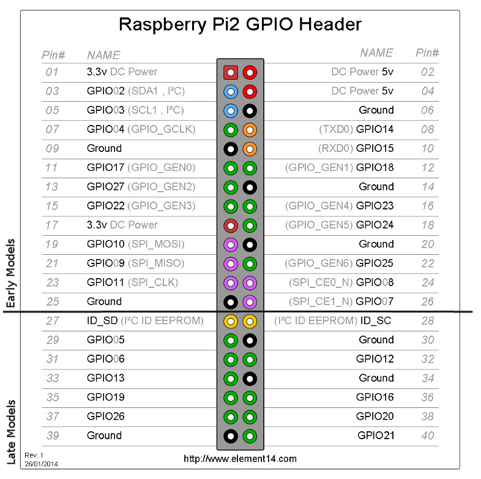

<div align="center">


<h1>BotWave - Your Raspberry Pi FM Network</h1>
<h4> <a href="https://botwave.dpip.lol">Website</a> | <a href="#installation">Install</a> | <a href="#ETC">Mentions</a> </h4>


</div>

BotWave lets you broadcast audio over FM radio using Raspberry Pi devices, with server-client management, remote control, automated actions, and more!


## Features

- **Server-Client Architecture**: Manage multiple Raspberry Pi clients from a central server.
- **Audio Broadcasting**: Broadcast audio files over FM radio.
- **File Upload**: Upload audio files to clients for broadcasting.
- **Remote Management**: Start, stop, and manage broadcasts remotely.
- **Authentication**: Client-server authentication with passkeys.
- **Protocol Versioning**: Ensure compatibility between server and clients.
- **Live broadcasting**: Stream live output from any application in real time. (Still in development, see [`#24`](https://github.com/dpipstudio/botwave/issues/24))

## Requirements 
> All requirements can be auto-installed with the automatic installer, see below.

### Server
- Python >= 3.6

### Client
- Raspberry Pi
- Root access
- Python >= 3.6
- [bw_custom](https://github.com/dpipstudio/bw_custom)
- (Wire or antenna)

> [!NOTE]
> We have a W.I.P wiki that explains some basics about BotWave. We recommand reading it at least once: [`/wiki`](https://github.com/dpipstudio/botwave/wiki)

> [!WARNING]
> - BotWave broadcasts FM signals, which may be regulated in your area.
> - Always check local laws before use; unauthorized broadcasts may incur fines.
> - Use a band-pass filter to minimize interference.
> - Author not responsible for legal issues or hardware damage.
> - Check the FAQ for more informations [`/wiki/FAQ`](https://github.com/dpipstudio/botwave/wiki/FAQ)


# Installation

For debian-like systems, we recommand using our automatic installation script, for other operating systems, you're on your own.

```bash
curl -sSL https://botwave.dpip.lol/install | sudo bash
```
<details>
<summary><code>Installer options</code></summary>
<p></p>
<pre>
Usage: curl -sSL https://botwave.dpip.lol/install | sudo bash [-s -- [MODE] [OPTIONS]]

Modes:
  client              Install client components
  server              Install server components
  both                Install both client and server components

Options:
  -l, --latest        Install from the latest commit (even if unreleased)
  -t, --to &lt;version&gt;  Install a specific release version
  -h, --help          Show this help message
</pre>
<p>Adding <code> -s &lt;server, client or both&gt;</code> at the end of the command skips the interactive menu and goes straight to installation.</p>
<p>Use <code> -s -- &lt;server, client or both&gt; &lt;options&gt;</code> to add options flags.</p>
<p>Note that all this is optional and not needed for basic installation.</p>
</details>

### BotWave Server For Cloud Instances
You can directly try BotWave `server` on Cloud Instances like Google Shell or GitHub Codespaces !  
[](https://shell.cloud.google.com/cloudshell/open?cloudshell_git_repo=https://github.com/dpipstudio/botwave&cloudshell_tutorial=misc_doc/google-shell.md&show=terminal)  
[](https://codespaces.new/dpipstudio/botwave)

## Hardware installation
To use BotWave Client for broadcasting, you need to set up the hardware correctly. This involves connecting an antenna or a cable to the Raspberry Pi's GPIO 4 (pin 7).

<div align="center"> </div>


## Updating BotWave
For debian-like systems, we recommand using our automatic uninstallation scripts, for other operating systems, you're on your own.

```bash
sudo bw-update
```

## Uninstallation
For debian-like systems, we recommand using our automatic uninstallation scripts, for other operating systems, you're on your own.

```bash
curl -sSL https://botwave.dpip.lol/uninstall | sudo bash
```

## Usage

BotWave usage depends on the tool you're using. Here's a breakdown of each component:

### **Server**
> This tool is included in the **SERVER** install.
The BotWave Server lets you manage multiple Raspberry Pi clients remotely, upload audio files, control broadcasts, and more.

**Full documentation:** [server/server.md](server/server.md)

---

### **Client**
> This tool is included in the **CLIENT** install.
The BotWave Client runs on a Raspberry Pi and connects to the server to receive and broadcast audio files over FM.

**Full documentation:** [client/client.md](client/client.md)

---

### **Local Client**
> This tool is included in the **CLIENT** install.
The Local Client allows you to broadcast audio files **without a server**, directly from the Raspberry Pi using command-line controls.

**Full documentation:** [local/local.md](local/local.md)

---

### **AutoRunner**
> This tool is included in the **CLIENT & SERVER** install.
The AutoRunner lets you set up `systemd` services to automatically start the BotWave Client or Server on boot.

**Full documentation:** [autorun/autorun.md](autorun/autorun.md)

---

*We highly recommend using the automatic installer to set up the desired components (`server`, `client`, or `both`):*

```bash
curl -sSL https://botwave.dpip.lol/install | sudo bash -s <server, client or both>
```

## ETC
**They talk about BotWave**: Here are some posts that talk about BotWave. Thanks to their creators !
<div align="center"> <!-- centering a div ?? -->
<p></p>
<a href="https://news.ycombinator.com/item?id=46305516" target="_blank"></a>
<a href="https://korben.info/botwave-raspberry-pi-emetteur-fm-radio.html" target="_blank"></a>
<a href="https://www.cyberplanete.net/raspberry-pi-radio-botwave/" target="_blank"></a>
</div>

## License
BotWave is licensed under [GPLv3.0](LICENSE).

## Credits


