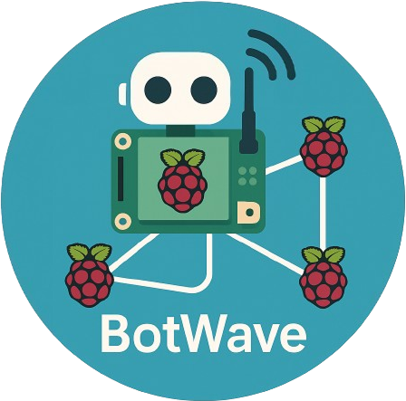

<div align=center>



<h1> BotWave - Your RPI FM Network </h1>
<h4> <a href="https://botwave.dpip.lol">botwave.dpip.lol btw</a></h4>   
</div>

BotWave is a system for broadcasting audio files over FM radio using Raspberry Pi devices. It consists of a server and client application that work together to manage and broadcast audio files.

## Features

- **Server-Client Architecture**: Manage multiple Raspberry Pi clients from a central server.
- **Audio Broadcasting**: Broadcast audio files over FM radio.
- **File Upload**: Upload audio files to clients for broadcasting.
- **Remote Management**: Start, stop, and manage broadcasts remotely.
- **Authentication**: Client-server authentication with passkeys.
- **Protocol Versioning**: Ensure compatibility between server and clients.

## Requirements 
> All requirements can be auto-installed with the automatic installer, see below.

### Server
- Python 3.x

### Client
- Raspberry Pi (recommended)
- Root access
- PiFmRds installed
- Python 3.x
- PiWave module

## Installation

For *nix systems, we recommand using our automatic installation scripts, for other operating systems, you're on your own.

```bash
curl -sSL https://botwave.dpip.lol/install | sudo bash -s <server, client or both>
```

> [!WARNING]
> **Warning**: Using BotWave involves broadcasting signals which may be subject to local regulations and laws. It is your responsibility to ensure that your use of BotWave complies with all applicable legal requirements and regulations in your area. Unauthorized use of broadcasting equipment may result in legal consequences, including fines or penalties.
>
> **Liability**: The author of BotWave is not responsible for any damage, loss, or legal issues that may arise from the use of this software. By using BotWave, you agree to accept all risks and liabilities associated with its operation and broadcasting capabilities.
>
> Please exercise caution and ensure you have the proper permissions and knowledge of the regulations before using BotWave for broadcasting purposes.

## Hardware installation
To use BotWave Client for broadcasting, you need to set up the hardware correctly. This involves connecting an antenna or a cable to the Raspberry Pi's GPIO 4 (pin 7).

<div align="center"> </div>


## Updating BotWave
For *nix systems, we recommand using our automatic uninstallation scripts, for other operating systems, you're on your own.

```bash
curl -sSL https://botwave.dpip.lol/update | sudo bash
```

## Uninstallation
For *nix systems, we recommand using our automatic uninstallation scripts, for other operating systems, you're on your own.

```bash
curl -sSL https://botwave.dpip.lol/uninstall | sudo bash
```

## Usage
See [server/server.md](server/server.md) for BotWave Server's usage, and [client/client.md](client/client.md) for BotWave Client's usage.

## License
BotWave is licensed under [GPLv3.0](LICENSE).

## Credits


